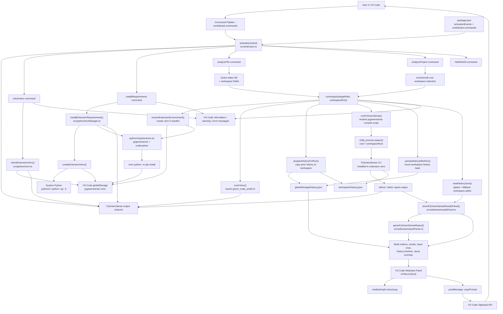

# PyGreenSense VS Code Extension Architecture

## Flow Summary

The extension is activated by the commands declared in `package.json` or when a Python file is opened. During activation, `src/extension.ts` registers all commands and creates the `PyGreenSense` output channel.

There are three main command paths:

- `checkVenv` reads the extension-owned virtual environment status from VS Code global storage.
- `installRequirements` creates or reuses that virtual environment and installs `python/requirements.txt`.
- `analyzeFile` and `analyzeProject` both resolve a target path, then call the shared `runAnalysis` pipeline.

The analysis pipeline ensures the Python environment exists, verifies the PyGreenSense CLI can be imported, prepares a temporary workspace `history.json`, runs the PyGreenSense CLI in the selected workspace, persists history back to global storage, then opens or refreshes the results webview.

The webview layer parses CLI stdout, combines it with persisted history metrics, renders the report UI, and sends `copyPrompt` messages back to the extension host when the user copies a generated remediation prompt.

## Main Modules

| Area | File | Responsibility |
| --- | --- | --- |
| Extension host | `src/extension.ts` | Activation, command registration, target resolution, shared analysis workflow |
| Python environment | `src/python/envManager.ts` | Bootstrap Python discovery, venv creation, requirements installation |
| Venv paths/status | `src/python/venv.ts` | Extension global-storage venv paths and health checks |
| CLI execution | `src/python/pythonRunner.ts` | Spawn venv Python / PyGreenSense console script and collect output |
| History storage | `src/python/history.ts` | Copy, move, read, and normalize `history.json` |
| Report parsing | `src/webview/reportParser.ts` | Extract metrics and issue groups from PyGreenSense stdout |
| Results UI | `src/webview/resultsPanel.ts` | Build the webview model, HTML, styling, and clipboard message handler |
| Bundled assets | `media/simple-cloud.png` | Cloud visual used by the webview |
| Python packages | `python/requirements.txt` | PyGreenSense and CodeCarbon dependencies installed into the venv |
